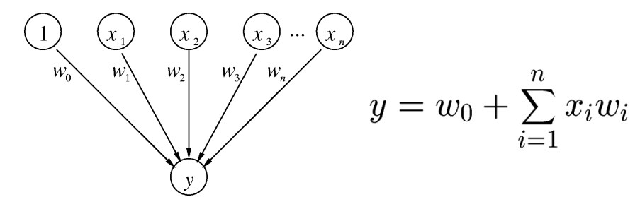
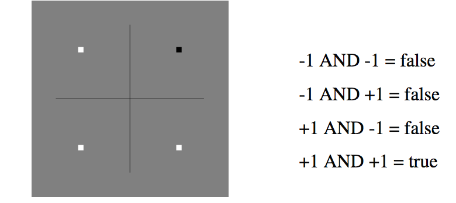

# Introduction

*In machine learning, the perceptron is an algorithm for supervised learning of binary classifiers (functions that can decide whether an input, represented by a vector of numbers, belongs to some specific class or not). It is a type of linear classifier, i.e. a classification algorithm that makes its predictions based on a linear predictor function combining a set of weights with the feature vector. The algorithm allows for online learning, in that it processes elements in the training set one at a time*(@perceptron). 

This model can solve linearly separable problems. Examples:

2D


3D


**When a problem is linearly non-separable, the Perceptron algorithm will not converge.**

The perceptron is a **key concept** in Neural Networks.

# The algorithm

The perceptron learning algorithm was developed by @rosenblatt.

This algorithm tries to find a separating hyperplane by minimizing the distance (i.e. euclidean distance, but there are many options) of misclassified points to the decision boundary. It starts with an initial guess as to the separating plane’s parameters and then updates that guess when it makes mistakes.

Visual representation (@murrell):



A perceptron defines a hyperplane in n+1 dimensional space:

$y = w_nx_n + w_{n-1}x_{n-1} + ... + w_1x_1 + w_0$

AND example:



The algorithm is the following:

```{r, eval = FALSE}
# w, x, y are vectors

initialize w = 0

# b parameter must also be included for the peceptron algorithm to deliver a valid separator.
# for incorrectly classified training samples b must be adjusted, too:

while any training observation (x, y) is not classified correcty {
  set w = w + learning_rate * yx
  set b = b + learning_rate * yR^2
  # where R is some constant larger than the distance from the
  # origin to the furtherest training sample
}
```

## Coding the algorithm

```{r}
DistanceFromPlane = function(z, w, b) {
  sum(z * w) + b
}

ClassifyLinear = function(x, w, b) {
  distances = apply(x, 1, DistanceFromPlane, w, b)
  return(ifelse(distances < 0, -1, +1))
}

EuclideanNorm <- function(x) {
  return(sqrt(sum(x * x)))
}

PerceptronFunction <- function(x, y, learning.rate = 1) {
  w = vector(length = ncol(x)) # initialize w
  b = 0 # Initialize b
  iterations = 0 # count iterations
  R = max(apply(x, 1, EuclideanNorm))
  convergence = FALSE # to enter the while loop
  while (!convergence) {
    convergence = TRUE # hopes luck
    yc <- ClassifyLinear(x, w, b)
    for (i in 1:nrow(x)) {
      if (y[i] != yc[i]) {
        convergence <- FALSE
        w <- w + learning.rate * y[i] * x[i,]
        b <- b + learning.rate * y[i] * R^2
        iterations <- iterations + 1
      }
    }
  }
s = EuclideanNorm(w)
return(list(w = w/s, b = b/s, steps = iterations))
}
```

Generate data:

```{r}
# very easy
# x2 = x1 + 1/2
x1 <- runif(50,-1,1)
x2 <- runif(50,-1,1)
x <- cbind(x1,x2)
y <- ifelse(x2 > 0.5 + x1, +1, -1)

PlotData <- function(x, y) {
  plot(x, pch = ifelse(y > 0, "+", "-"), xlim = c(-1,1), ylim = c(-1,1), cex = 2)
  abline(0.5,1)
  points(c(0,0), c(0,0), pch = 19)
  lines(c(0,-0.25), c(0,0.25), lty = 2)
  arrows(-0.3, 0.2, -0.4, 0.3)
  text(-0.45, 0.35, "w", cex = 2)
  text(-0.0, 0.15, "b", cex = 2)
}

PlotData(x, y)
```

Test the perceptron

```{r}
the_perceptron <- PerceptronFunction(x,y)
predicted_y <- ClassifyLinear(x, the_perceptron$w, the_perceptron$b)
# error
print(sum(abs(y - predicted_y)))
```

# Assignment

1. Try other learning rates. Which one is the cost function? Explain the algorithm (help: http://www.dbs.ifi.lmu.de/Lehre/MaschLernen/SS2014/Skript/Perceptron2014.pdf)
2. Try to plot the plane (or the line) every *z* iterations
3. Try another example with new random data (please, do not use the iris data). Use a *complex* dataset looking for a non-completely linearly separated sample. 

Use the RMarkdown format

# References

---
references:
- id: template
  title: Binary classification
  author:
  - family: Fenner
    given: Martin
  container-title: Nature Materials
  volume: 11
  URL: 'http://dx.doi.org/10.1038/nmat3283'
  DOI: 10.1038/nmat3283
  issue: 4
  publisher: Nature Publishing Group
  page: 261-263
  type: article-journal
  issued:
    year: 2012
    month: 3
    
- id: perceptron
  title: Perceptron
  author:
  - family: Wikipedia - Perceptron
  URL: 'https://en.wikipedia.org/wiki/Perceptron'
  issued:
    year: 2017

- id: rosenblatt
  title: The Perceptron. A Probabilistic Model for Information Storage and Organization in the Brain
  author:
  - family: Rosenblatt
  given: Frank
  container-title: Psychological Review
  volume: 65
  issue: 6
  publisher: American Psychological Association
  page: 386–408
  type: article-journal
  issued:
    year: 1958

- id: murrell
  title: Linear Classifiers and the Perceptron Algorithm
  author:
  - family: Murrell
  given: Hugh
  URL: 'http://www.cs.ukzn.ac.za/~hughm/dm/content/slides07.pdf'
  issued:
    year: 2017
---